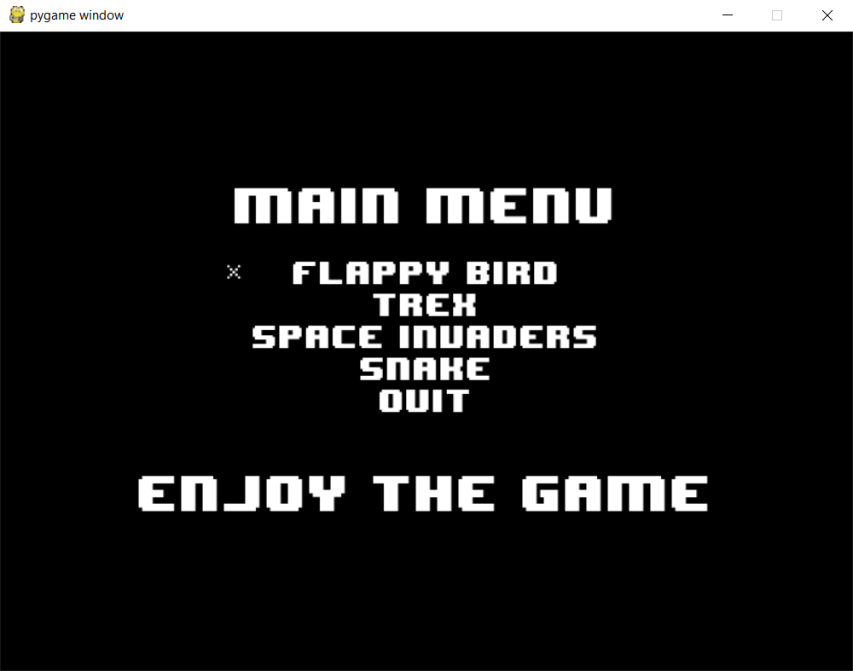
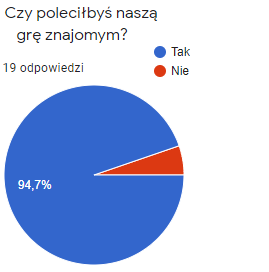

# **Welcome to the Okon wiki!**
## Członkowie projektu:  
* Jakub Woźniak
* Małgorzata Czarnecka
* Konrad Bałabuszek
* Bartłomiej Łaciak  

---
## Narzędzia z których korzystamy
1. [Slack](https://slack.com/intl/en-pl/)
2. [Trello](https://trello.com/pl)
3. [Doodle](https://doodle.com/en/)  

---
### Głównym językiem z którego korzystamy jest *Python*  
`print("Hello World!")`

Przykładowa pętla while:  
```
while done==False:
    for event in pygame.event.get():
        if event.type == pygame.QUIT:
            done=True 


        if event.type == pygame.JOYBUTTONDOWN:
            print("Joystick button pressed.")
        if event.type == pygame.JOYBUTTONUP:
            print("Joystick button released.")


    screen.fill(WHITE)
    textPrint.reset()

    joystick_count = pygame.joystick.get_count()

    for i in range(joystick_count):
        joystick = pygame.joystick.Joystick(i)
        joystick.init()

        name = joystick.get_name()
        textPrint.print(screen, "Joystick name: {}".format(name) )

        buttons = joystick.get_numbuttons()
        textPrint.print(screen, "Number of buttons: {}".format(buttons) )
        textPrint.indent()

        for i in range( buttons ):
            button = joystick.get_button( i )
            textPrint.print(screen, "Button {:>2} value: {}".format(i,button) )
        textPrint.unindent()

        pygame.display.flip()

clock.tick(20)

pygame.quit ()  
```


# Streszczenie dokumentacji projektu
Nasz projekt jest zbiorem 4 bardzo prostych, a jednocześnie ciekawych gierek, do których umożliwiamy łatwy dostęp poprzez przystępne menu, które wygląda w ten oto sposób:  



### Gry w jakie użytkownik jest w stanie zagrać:  
1. Flappy Bird
2. Snake
3. Trex
4. Space Invaders

## Udało nam się zdobyc opinie na temat naszego projektu, oto wyniki: 


